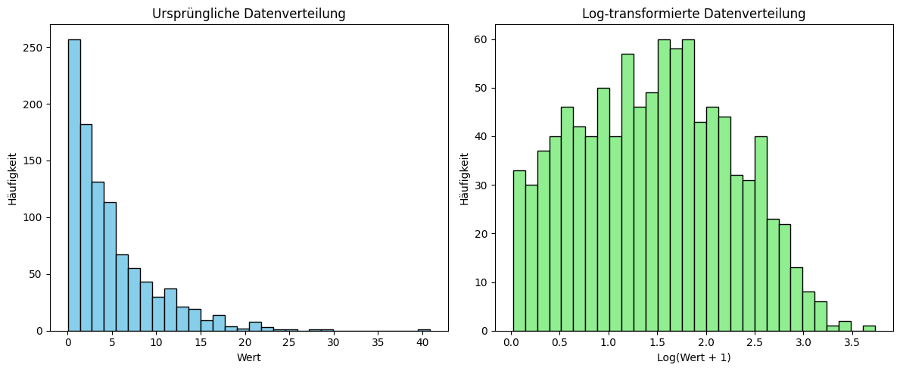

## QM-56-4 Logarithmische Transformation

### Beschreibung

Die logarithmische Transformation wird in der Statistik und im maschinellen Lernen verwendet, um bestimmte Eigenschaften von Daten zu verändern. Dabei wird der natürliche Logarithmus (oder ein anderer Logarithmus) auf jede Beobachtung eines Datensatzes angewendet. Dies kann dazu beitragen, die Verteilung der Daten zu normalisieren, Varianzen zu stabilisieren und den Einfluss von Ausreißern zu reduzieren. 

Die logarithmische Transformation kann positive Schiefe reduzieren und die Daten näher an eine Normalverteilung bringen. In Fällen, in denen die Varianz der Daten mit dem Mittelwert korreliert, ist kann die Log-Transformation die Varianz stabilisieren. 

Große Werte werden durch die Log-Transformation komprimiert, was den Einfluss von Ausreißern auf Modelle reduziert. Wenn zwei Variablen eine exponentielle Beziehung haben, kann die Anwendung des Logarithmus die Beziehung linear machen, was für lineare Modelle hilfreich ist.

### Methode

- **Geeignete Merkmale identifizieren**: Untersuchen Sie die Datenverteilungen und wählen Sie Merkmale mit positiver Schiefe oder Ausreißern aus.
- **Umgang mit Null- und Negativwerten**: Fügen Sie eine kleine positive Konstante (z.B. 1) hinzu, um sicherzustellen, dass alle Werte positiv sind.
- **Transformation anwenden**: Wenden Sie die Logarithmusfunktion auf die ausgewählten Merkmale an (z.B. `Merkmal_log = log(Merkmal_neu)`).
- **Transformierte Daten überprüfen**: Prüfen Sie, ob die Verteilung normaler und die Varianz stabiler geworden ist, indem Sie die Daten visualisieren und statistische Kennzahlen berechnen.
- **Integration ins Modell**: Nutzen Sie die transformierten Merkmale beim Training Ihres Modells und überprüfen Sie die Modellannahmen.
- **Interpretation und Rücktransformation**: Interpretieren Sie die Ergebnisse im Kontext der Transformation und führen Sie bei Bedarf eine Rücktransformation durch (z.B. `Merkmal_orig = exp(Merkmal_log)`).

### Sourcecode "Logarithmische Transformation"
| RefID | Verweis                                  | Inhalt                                  |
| ----- | ---------------------------------------- | --------------------------------------- |
| 75    | QM-56-4 LogarithmicTransformation_python | Logarithmische Transformation in Python |

### Referenzen
| RefID | Verweis                                                                        | Kurzbeschr.                                                                                                                                                                                                                                                                                                                                                                                                                                                |
| ----- | ------------------------------------------------------------------------------ | ---------------------------------------------------------------------------------------------------------------------------------------------------------------------------------------------------------------------------------------------------------------------------------------------------------------------------------------------------------------------------------------------------------------------------------------------------------- |
| 180   |  The elements of statistical learning: data mining, inference, and prediction  | Dieses Buch bietet einen umfassenden Überblick über Schlüsselkonzepte des Data Mining in Bereichen wie Medizin und Finanzen und konzentriert sich dabei auf überwachtes und unüberwachtes Lernen. Es behandelt Themen wie neuronale Netze, Boosting und fügt neue Inhalte zu Random Forests, Ensemble-Methoden und dem Umgang mit „großen“ Daten hinzu. Es ist nützlich für Statistiker und diejenigen, die in der Wissenschaft oder Industrie tätig sind. |

