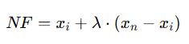

## QM-57-1 Synthetic Minority Over-sampling Technique

### Beschreibung

SMOTE steht für Synthetic Minority Over-sampling Technique. Es ist eine Methode, die im Bereich des maschinellen Lernens und der Datenanalyse eingesetzt wird, um das Problem unausgeglichener Datensätze in Angriff zu nehmen. Unausgeglichene Datensätze liegen vor, wenn die Anzahl der Beispiele in den verschiedenen Klassen stark variiert. Dies führt oft dazu, dass die Modelle die Mehrheitsklasse(n) bevorzugen und schlecht bei der Vorhersage von Minderheitsklasse(n) abschneiden. SMOTE hilft, dieses Problem zu lösen, indem es künstliche Datenpunkte für die Minderheitsklasse generiert, anstatt einfach Kopien der existierenden Minderheitsklassen-Beispiele zu machen (wie es beim herkömmlichen Over-sampling der Fall wäre). 

Die Technik wählt zufällige Beispiele aus der Minderheitsklasse aus und berechnet dann für diese Beispiele die k-nearest Neighbor. Synthetische Beispiele werden dann erzeugt, indem für ein zufällig ausgewähltes Beispiel aus der Minderheitsklasse und einen seiner k-nächsten Nachbarn ein Vektor zwischen den beiden gezogen und ein neuer Datenpunkt entlang dieses Vektors zufällig platziert wird.

#### Vorteile von SMOTE

- **Verbesserte Klassengleichheit**: Durch die Erhöhung der Anzahl von Beispielen in der Minderheitenklasse hilft SMOTE, das Problem des Klassenungleichgewichts zu mildern.
- **Verminderung des Overfittings**: Indem neue, einzigartige Beispiele erzeugt werden, anstatt einfache Kopien zu erstellen, hilft SMOTE, das Overfitting zu reduzieren, das bei traditionellen Oversampling-Techniken auftreten kann.
- **Bessere Generalisierung**: Da die synthetischen Beispiele realistische Variationen zwischen existierenden Beispielen darstellen, kann das Modell besser generalisieren und ist potenziell effektiver bei der Vorhersage neuer, unbekannter Daten.

#### Limitationen von SMOTE

- **Nicht ideal für hohe Dimensionen**: In sehr hochdimensionalen Räumen kann SMOTE weniger effektiv sein, da die Distanzberechnung zwischen den Datenpunkten weniger aussagekräftig wird (sog. "Fluch der Dimensionalität").
- **Anfälligkeit für Rauschen**: Wenn die Minderheitenklasse Rauschen enthält, kann SMOTE dieses Rauschen verstärken, indem es synthetische Daten erzeugt, die auf rauschbehafteten Beispielen basieren.
- **Nicht geeignet für kategoriale Daten**: SMOTE ist primär für kontinuierliche und numerische Daten konzipiert. Bei kategorialen Daten können die interpolierten Werte nicht sinnvoll sein, es sei denn, es werden spezielle Anpassungen vorgenommen.

### Methode

- **Auswahl eines Datensatzes aus der Minderheitenklasse**: Ein zufälliger Datensatz wird aus der Minderheitenklasse ausgewählt.
- **Finden der Nachbarn**: Für den gewählten Datensatz werden die k-nächsten Nachbarn in der Minderheitenklasse gefunden. Der Parameter 𝑘 ist dabei vom Anwender spezifiziert und bestimmt die Anzahl der nächsten Nachbarn, die betrachtet werden.
- **Synthetisches Beispiel erzeugen**: Ein Nachbar wird zufällig aus den k-nearest Neighbor ausgewählt. Ein synthetischer Datenpunkt wird dann durch Interpolation zwischen dem ursprünglichen Datenpunkt und diesem zufällig ausgewählten Nachbarn erzeugt. Speziell wird für jede Feature-Dimension:

- NF = Neuer, interpolierter Wert
- $x_i$ = Feature des ursprünglichen Datensatzes
- $lambda$ = Zufallsfaktor, eine Zahl zwischen 0 und 1, die bestimmt wie nahe der neue synthetische Datenpunkt am ursprünglichen Daten im Vergleich zum Nachbarn liegen soll. Ein Wert nahe 0 bedeutet, dass der synthetische Punkt sehr nah am ursprünglichen Datenpunkt liegt, während ein Wert nahe 1 bedeutet, dass der synthetische Punkt näher am Nachbarn liegt. 
- $x_n$ = Dies ist der Wert desselben Features, aber für einen der nächsten Nachbarn des ursprünglichen Datenpunktes in der Minderheitenklasse

### Pythoncode "SMOTE"
| RefID | Verweis            |
| ----- | ------------------ |
| 78    | QM-57_SMOTE_python |

### Referenzen
| RefID | Verweis                                             | Kurzbeschr.                                                                                                                                                                                                                                                                                                                                                                                         |
| ----- | --------------------------------------------------- | --------------------------------------------------------------------------------------------------------------------------------------------------------------------------------------------------------------------------------------------------------------------------------------------------------------------------------------------------------------------------------------------------- |
| 186   |  SMOTE: Synthetic Minority Over-sampling Technique  | Das Papier schlägt vor, eine Überstichprobe der Minderheitsklasse mit einer Unterstichprobe der Mehrheitsklasse zu kombinieren, um die Leistung des Klassifikators bei unausgeglichenen Datensätzen zu verbessern. Diese Methode übertrifft die alleinige Unterabtastung und Anpassungen in Ripper- und Naive-Bayes-Klassifikatoren, die anhand der konvexen Hülle von AUC und ROC bewertet werden. |

