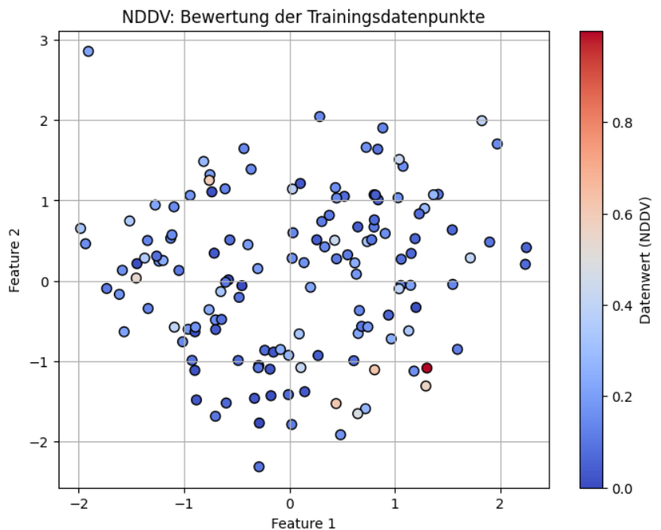

## QM-61-3 Neural Dynamic Data Valuation

### Beschreibung

Die Neural Dynamic Data Valuation (NDDV) ist eine Methode zur Bewertung von Datenpunkten oder Datensätzen in einem neuronalen Netzwerk. Diese Methode basiert auf Konzepten der optimalen Steuerung und verwendet neuronale Netzwerke, um den Wert von Datenpunkten dynamisch zu bewerten.

- Perspektive der optimalen Steuerung: Die NDDV nutzt Prinzipien der optimalen Steuerung, um den Wert von Datenpunkten zu bewerten. Dies bedeutet, dass die Datenpunkte als potenzielle Steuerungsvariablen betrachtet werden, die verwendet werden können, um das Verhalten des neuronalen Netzwerks zu beeinflussen oder zu steuern.
- Neuronale Netzwerkarchitektur: Die NDDV verwendet ein neuronales Netzwerk als Modell, um den Wert von Datenpunkten zu schätzen. Das Netzwerk kann verschiedene Architekturen haben, einschließlich Feedforward- oder recurrent Neural Networks, und kann auf einem bestimmten Datensatz trainiert werden.
- Dynamische Bewertung: Im Gegensatz zu statischen Bewertungsmethoden bewertet die NDDV den Wert von Datenpunkten dynamisch, indem sie die Inference Ausgabe über die Zeit verfolgt. Dies ermöglicht es, den Beitrag eines Datenpunkts zu einem bestimmten Zeitpunkt zu bewerten und ihn im Verlauf der Zeit anzupassen.
- Theoretische Grundlagen: Die NDDV hat solide theoretische Interpretationen, die es ermöglichen, den Wert von Datenpunkten genau zu identifizieren. Dies erfolgt durch Analyse der Sensitivität der Inference Ausgabe auf Veränderungen der Datenpunkte.
- Daten-Neugewichtungsstrategie: Die NDDV implementiert eine Daten-Neugewichtungsstrategie, um die einzigartigen Merkmale von Datenpunkten besser zu berücksichtigen und Fairness durch die Interaktion zwischen Datenpunkten und den Mittelwertszuständen zu gewährleisten.
- Trainingsprozess: Das neuronale Netzwerk der NDDV wird auf einem Datensatz trainiert, um den Wert von Datenpunkten zu schätzen. Der Trainingsprozess erfolgt nur einmal und ermöglicht es dem Netzwerk, den Wert aller Datenpunkte effizient zu schätzen.

Durch die Kombination von Prinzipien der optimalen Steuerung und neuronalen Netzwerken ermöglicht die NDDV eine dynamische und präzise Bewertung des Wertes von Datenpunkten in einem breiten Anwendungsspektrum. Dies kann dazu beitragen, Entscheidungsfindung und Datenmanagement in verschiedenen Bereichen zu verbessern, einschließlich maschinelles Lernen, 
Datenanalyse und Optimierung von Systemen.

### Methode

Die Durchführung einer Neural Dynamic Data Valuation (NDDV) umfasst  mehrere Schritte:

- **1. Problemformulierung**
    - Ziel: Schätze den Wert jedes Trainingsdatenpunkts im Hinblick auf seinen Beitrag zum Modelltraining.
    - Ansatz: Nutze lernbare Gewichtungen, um die relative Bedeutung jedes Datenpunkts dynamisch zu erfassen.
        
- **2. Datensatzvorbereitung**
    - Erzeuge oder lade einen Klassifikationsdatensatz.
    - Normalisiere die Eingabefeatures.
    - Teile die Daten in Trainings- und Testmengen.
        
- **3. Modellinitialisierung**
    - Definiere ein einfaches neuronales Netz zur Klassifikation.
    - Initialisiere die Modellparameter zufällig.

- **4. Einführung lernbarer Gewichtungen**
    - Weise jedem Trainingsdatenpunkt ein separates, lernbares Gewicht zu.
    - Die Gewichtung repräsentiert den geschätzten "Wert" des jeweiligen Punktes.
        
- **5. Definition der Verlustfunktion**
    - Verwende eine punktweise berechnete Verlustfunktion (z. B. Binary Cross-Entropy ohne Mittelung).
    - Multipliziere jeden Verlust mit dem zugehörigen Datengewicht.
    - Bilde den gewichteten Mittelwert als Gesamtkriterium für den Optimierer.
        
- **6. Gemeinsames Training von Modell und Datengewichtungen**
    - Optimiere gleichzeitig die Modellparameter und die Datengewichtungen.
    - Stelle sicher, dass die Gewichtungen positiv bleiben (z. B. über Softplus-Aktivierung).
    - Führe mehrere Trainingsdurchläufe (Epochen) durch.
        
- **7. Auswertung der Datengewichtungen**
    - Interpretiere die finalen, optimierten Gewichtungen als Datenwerte.
    - Höhere Werte → größere Bedeutung für den Lernerfolg des Modells.

- **8. Visualisierung und Analyse**
    - Visualisiere die Datenpunkte farbcodiert nach ihrem erlernten Wert.
    - Identifiziere besonders einflussreiche oder redundante Punkte.
    - Ziehe Schlüsse für Datenreduktion, Active Learning oder Qualitätskontrolle.

### Sourcecode "Neural Dynamic Data Valuation"

| RefID | Verweis                                      | Inhalt |
| ----- | -------------------------------------------- | ------ |
| 84    | QM-61-3_Neural Dynamic Data Valuation_python | \-     |

### Referenzen

| RefID | Verweis                         | Kurzbeschr.                                                                                                                                                                                                       |
| ----- | ------------------------------- | ----------------------------------------------------------------------------------------------------------------------------------------------------------------------------------------------------------------- |
| 132   |  Neural Dynamic Data Valuation  | NDDV nutzt optimale Kontrolltheorie und einmaliges Training mit Mean-Field-Re-Weighting, um fair und effizient den Wert jedes Datenpunkts zu ermitteln und übertrifft so herkömmliche, rechenintensive Verfahren. |

