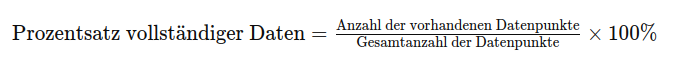

## QM-67 Provenienz-Vollständigkeitsrate

### Beschreibung

**Provenienz-Vollständigkeitsrate** bezeichnet den Anteil der Datensätze innerhalb eines Datensatzes, für die vollständig nachvollziehbare und dokumentierte Herkunftsinformationen vorliegen. Diese Metrik bewertet, in welchem Umfang alle relevanten Provenienz-Daten – wie etwa der Ursprung, Erhebungsmethoden, sowie alle Transformationen und Verarbeitungsschritte – erfasst und in den Metadaten dokumentiert sind. Eine hohe Provenienz-Vollständigkeitsrate signalisiert, dass nahezu jeder Dateneintrag über alle notwendigen Herkunftsinformationen verfügt, was die Nachvollziehbarkeit, Integrität und Glaubwürdigkeit der Trainingsdaten erhöht. Im Allgemeinen wird sie als Prozentsatz angegeben, wobei 100 % bedeutet, dass alle Datensätze vollständig mit Provenienz-Daten versehen sind.

### Methode

- Fehlende Datensätze 

- Vollständige Datensätze

### Beispiele 

#### Klimadaten-Forschung:

In einem Datensatz zur Analyse globaler Temperaturtrends werden Messwerte von verschiedenen Wetterstationen zusammengeführt. Von insgesamt 10000 Datensätzen enthalten 9500 Einträge vollständige Provenienzinformationen (Standort der Wetterstation, Erhebungsmethode, Datum der Messung, vorgenommene Kalibrierungen und alle Transformationen). Die Provenienz-Vollständigkeitsrate beträgt somit 95 %, was eine hohe Nachvollziehbarkeit und Qualität der Daten signalisiert.
    
#### Unternehmens-CRM-System:

Ein CRM-System speichert Kundendaten, die aus unterschiedlichen Quellen (z.B. Online-Formulare, telefonische Kontakte, Kundenportale) stammen. Bei einer Überprüfung stellt sich heraus, dass 8000 von 10000 Datensätzen alle relevanten Informationen zur Datenherkunft enthalten, wie Erstellungsdatum, Ursprungsquelle, Verantwortlicher Ersteller und nachträgliche Aktualisierungen. Die Provenienz-Vollständigkeitsrate liegt hier bei 80%, was auf Optimierungspotenziale bei der Erfassung der Herkunftsmetadaten hinweist.

### Referenzen

| RefID | Verweis           | Kurzbeschr.                                                                                                                                                                                                                                                                         |
| ----- | ----------------- | ----------------------------------------------------------------------------------------------------------------------------------------------------------------------------------------------------------------------------------------------------------------------------------- |
| 287   |  Data Provenance  | Der Artikel bietet eine umfassende Einführung in die Datenherkunft, die sich von einem Nischenthema zu einem zentralen Forschungsfeld in Datenbanken und verwandten Disziplinen entwickelt hat und richtet sich an Forscher sowie Praktiker mit grundlegenden Datenbankkenntnissen. |

