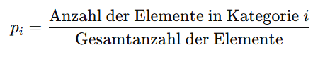
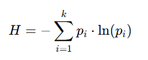

## QM-68-1 Shannon-Index

### Beschreibung

Der **Shannon-Index** ist ein Maß für die **Diversität** in einer Verteilung und wird häufig in der **Ökologie**, **Informations- und Datenwissenschaft** sowie **Statistik** verwendet. 

### Formel

Für jede Kategorie $i$ wird der Anteil $p_i$ an der Gesamtzahl der Elemente bestimmt.

Der Shannon-Index $H$ wird mit folgender Formel berechnet:

- $k$: Anzahl der verschiedenen Klassen (z. B. Arten in einem Ökosystem, Kategorien in einer Verteilung)
- $p_i$​: Anteil (relative Häufigkeit) der Klasse i an der Gesamtheit
- $ln$: Natürlicher Logarithmus

Dabei summiert man über alle $k$ Kategorien und verwendet den natürlichen Logarithmus.

#### Interpretation:
- **Niedrige Werte:** Bei geringer Vielfalt, z. B. wenn fast alle Elemente in eine Kategorie fallen, ist H niedrig.
- **Hohe Werte:** Bei hoher Vielfalt, bei der die Elemente gleichmäßig über viele Kategorien verteilt sind, steigt H.

Zusammenfassend misst der Shannon-Index sowohl die Anzahl der Kategorien als auch die Gleichmäßigkeit ihrer Verteilung, was ihn zu einem robusten Instrument zur Bewertung von Diversität macht.

### Sourcecode "Shannon-Index"
| RefID | Verweis                      | Inhalt                                            |
| ----- | ---------------------------- | ------------------------------------------------- |
| 85    | QM-68-1_Shannon-Index_python | Einfaches Beispiel mit Baumarten und Mitarbeitern |

### Referenzen

| RefID | Verweis                                                                                                                                          | Kurzbeschr.                                                                                                                                                                       |
| ----- | ------------------------------------------------------------------------------------------------------------------------------------------------ | --------------------------------------------------------------------------------------------------------------------------------------------------------------------------------- |
| 277   |  Shannon-Index                                                                                                                                   | Metrik zur Berechnung der Vielfalt einer Verteilung                                                                                                                               |
| 303   |  A tribute to Claude Shannon (1916–2001) and a plea for more rigorous use of species richness, species diversity and the ‘Shannon–Wiener’ Index  | Die Autoren plädieren für eine klare Definition der Begriffe Artenreichtum und Artenvielfalt, betonen die weite Verbreitung des Shannon-Index trotz uneinheitlicher Namensgebung. |
