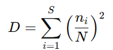
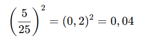
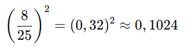
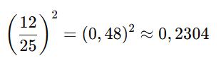

## QM-68-2 Simpson-Index

### Beschreibung

Der Simpson-Index (manchmal auch Simpson’s Diversity Index genannt) ist ein Maß zur Bewertung der Artenvielfalt in einer Gemeinschaft. Er fasst zusammen, wie wahrscheinlich es ist, dass zwei zufällig ausgewählte Individuen derselben Art angehören. Im Folgenden erläutere ich, wie der Simpson-Index berechnet wird und welche Varianten es gibt.

- **Hoher Indexwert (D nahe 1):** Deutet darauf hin, dass wenige Arten den Großteil der Individuen ausmachen (geringe Diversität).
    
- **Niedriger Indexwert (D nahe 0):** Zeigt eine hohe Diversität, also eine gleichmäßigere Verteilung der Individuen über die Arten hinweg.
### Formel

wobei:

- S ist die Anzahl der Arten in der Gemeinschaft ist,
- $n_i$ ist die Anzahl der Individuen der Art i darstellt,
- N ist die Gesamtzahl aller Individuen in der Gemeinschaft.

#### Varianten des Index

- Simpsons Diversity Index (1-D)

Ein Wert nahe 1 deutet hier auf eine hohe Diversität hin, während Werte nahe 0 auf eine geringe Diversität schließen lassen.

- Simpsons Reciprocal Index (1/D)

Dabei erreicht der Index den minimalen Wert 1 (wenn nur eine Art vorhanden ist) und steigt mit zunehmender Artenvielfalt an. Eine höhere Zahl entspricht also einer höheren Diversität.

### Beispiele 

#### Beispiel 1

Angenommen, in einer Gemeinschaft gibt es drei Arten mit folgenden Individuenzahlen:

- Art A: 5 Individuen
- Art B: 8 Individuen
- Art C: 12 Individuen

**Schritt 1: Gesamtzahl berechnen**

N=5+8+12=25

**Schritt 2: Berechnung der Anteilsquadrate**

Für Art A:

Für Art B:

Für Art C:

**Schritt 3: Simpson-Index D bestimmen**

- Mit D≈0,3728 liegt die Wahrscheinlichkeit, dass zwei zufällig ausgewählte Individuen derselben Art angehören, bei ca. 37%.
- Wählt man anstelle von D den Diversity-Index 1−D, so erhält man:
    1−0,3728≈0,62721 
- Dieser Wert zeigt in diesem Fall eine moderate Diversität an.

### Sourcecode "Simpson-Index"

| RefID | Verweis                      | Inhalt                                                                       |
| ----- | ---------------------------- | ---------------------------------------------------------------------------- |
| 86    | QM-68-2_Simpson-Index_python | Berechnet den Simpson-Index und seine Varianten für gegebene Artenzählungen. |

### Referenzen

| RefID | Verweis                    | Kurzbeschr.                                                                                                                                               |
| ----- | -------------------------- | --------------------------------------------------------------------------------------------------------------------------------------------------------- |
| 295   |  Measurement of Diversity  | Das Paper benennt ein mathematisches Maß zur Quantifizierung von Diversität in Gemeinschaften, dass bis heute in Ökologie und Statistik Anwendung findet. |
