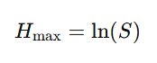
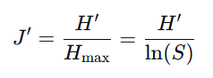
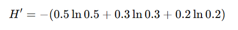
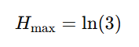

## QM-68-3 Pielous Eveness Index

### Beschreibung

Bewertet, wie gleichmäßig die Elemente auf die vorhandenen Kategorien verteilt sind. Ein Wert nahe 1 signalisiert eine nahezu gleichmäßige Verteilung.

### Formel

Pielous Evenness basiert auf der Shannon-Entropie (H'), die ein Maß für die Informationsunsicherheit bzw. Diversität in einer Gemeinschaft ist. Die Shannon-Entropie wird folgendermaßen berechnet:

wobei:

- S die Gesamtzahl der Arten in der Gemeinschaft ist.
- $p_i$​ der relative Anteil (Proportion) der Individuen der Art i an der Gesamtanzahl der Individuen ist.

Da der maximale Wert von H′ erreicht wird, wenn alle Arten gleich häufig vertreten sind, kann der Maximalwert als:

definiert werden. 

Die Formel für Pielous Evenness (J') lautet dann:

#### Interpretation der Werte

- **Wertebereich:** J′ liegt zwischen 0 und 1.
    - J′≈1 Eine hohe Evenness bedeutet, dass die Individuen nahezu gleichmäßig über alle Arten verteilt sind.
    - J′≈0 Eine niedrige Evenness deutet darauf hin, dass einige Arten sehr dominant sind, während andere nur sehr wenige Individuen aufweisen.

### Beispiele 

#### Beispiel 1

In einer ökologischen Studie werden drei Arten mit unterschiedlichen Häufigkeiten gezählt:

- Art A: 50 Individuen
- Art B: 30 Individuen
- Art C: 20 Individuen

Die relativen Anteile wären:

- $p_A$ = 0.5
- $p_B$ = 0.3
- $p_C$ = 0.2

Die Shannon-Entropie H′ berechnet sich zu:

Der maximale Wert H_max​ bei S=3 ist:

Mit diesen Werten kann man J′ ausrechnen, was ein quantitativer Ausdruck dafür ist, wie gleichmäßig die Individuen über die Arten verteilt sind.

### Sourcecode "Pielous Eveness Index"
| RefID | Verweis                              | Inhalt                                              |
| ----- | ------------------------------------ | --------------------------------------------------- |
| 88    | QM-68-3_Pielous Eveness Index_python | Kurze berechnung einer Artenhäufigkeit mit PE Index |

### Referenzen
| RefID | Verweis                                                                     | Kurzbeschr.                                                                                                     |
| ----- | --------------------------------------------------------------------------- | --------------------------------------------------------------------------------------------------------------- |
| 279   |  The measurement of diversity in different types of biological collections  | Der Informationsgehalt kann als Maß für die Vielfalt einer biologischen Sammlung vieler Arten verwendet werden. |

