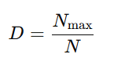
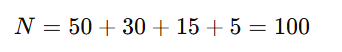
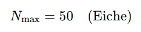
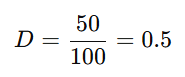
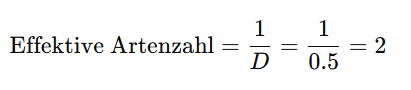

## QM-68-4 Berger-Parker Index

### Beschreibung

Konzentriert sich auf den Anteil der dominierenden Kategorie. Ein höherer Wert weist auf eine geringe Vielfalt und Dominanz einzelner Kategorien hin.

### Formel

Der Index basiert auf dem Anteil der dominanten Art an der Gesamtzahl der Individuen in einer untersuchten Gemeinschaft. Er wird üblicherweise wie folgt berechnet:

- $N_max$: Anzahl der Individuen der am häufigsten vorkommenden (dominanten) Art.
- N: Gesamtzahl aller Individuen in der Population.

Ein hoher Wert von D bedeutet, dass ein großer Anteil der Gesamtpopulation von einer einzigen Art dominiert wird, während ein niedriger Wert auf eine geringere Dominanz und tendenziell eine höhere Artenvielfalt hindeutet.

#### Interpretation des Index

- D=1: Dies ist der Extremfall, bei dem die gesamte Population aus nur einer Art besteht, was auf maximale Dominanz und minimale Diversität hinweist.
- D<1: Je weiter der Wert von 1 entfernt ist (also je kleiner D wird), desto geringer ist der Anteil der dominanten Art – was darauf hindeutet, dass andere Arten in signifikanten Anteilen vorhanden sind.

### Beispiele 

#### Beispiel 1

Nehmen wir an, wir untersuchen einen kleinen Wald, in dem vier Baumarten vorkommen. Die erfassten Anzahl der Individuen sieht folgendermaßen aus:

|Baumart|Anzahl der Individuen|
|---|---|
|Eiche|50|
|Buche|30|
|Ahorn|15|
|Tanne|5|

##### Schritt 1: Bestimmung der Gesamtzahl der Individuen

Zuerst summieren wir die Individuen aller Arten:

##### Schritt 2: Identifikation der dominanten Art

Die dominante Art ist diejenige, die die höchste Anzahl an Individuen besitzt. In diesem Beispiel ist das:

##### Schritt 3: Berechnung des Berger-Parker Index

Der Berger-Parker Index D berechnet sich mit der Formel:

Setzen wir die Werte ein:

##### Interpretation des Ergebnisses

- Wert D=0.5: Dies bedeutet, dass 50% der Gesamtpopulation von einer einzigen Art (hier der Eiche) dominiert werden.
    
- Bedeutung: Ein höherer Indexwert (näher an 1) zeigt eine starke Dominanz einer Art an und weist auf eine geringere Diversität hinsichtlich der Häufigkeitsverteilung hin. Im Gegensatz dazu würde ein niedrigerer Wert darauf hinweisen, dass das Individuenaufkommen gleichmäßiger auf die Arten verteilt ist.

Optional lässt sich der Kehrwert des Index berechnen, um die "effektive Artenzahl" zu bestimmen:

### Sourcecode "Berger-Parker Index"
| RefID | Verweis                            |
| ----- | ---------------------------------- |
| 89    | QM-68-4_Berger Parker Index_python |

### Referenzen

| RefID | Verweis                                                                                                                 | Kurzbeschr.                                                                                                                                                                            |
| ----- | ----------------------------------------------------------------------------------------------------------------------- | -------------------------------------------------------------------------------------------------------------------------------------------------------------------------------------- |
| 280   |  Choosing and using diversity indices: insights for ecological applications from the German Biodiversity Exploratories  | Die Studie zeigt, dass die Wahl des Diversitätsindex – insbesondere die Verwendung von Shannon’s H' – entscheidend die Interpretation komplexer ökologischer Interaktionen beeinflusst |
