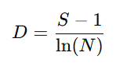

## QM-68-5 Margalef-Richness Index

### Beschreibung

Der Margalef-Richness-Index ist ein ökologischer Diversitätsindex, der die Artenvielfalt einer Gemeinschaft anhand der reinen Artenzahl in Relation zur Gesamtzahl der Individuen misst. Er wird häufig in der Ökologie verwendet, um Lebensgemeinschaften miteinander zu vergleichen, wobei er insbesondere die Artenreichhaltigkeit quantifiziert.

### Formel

Der Index basiert auf der Annahme, dass bei einer größeren Anzahl an Individuen auch typischerweise mehr Arten gefunden werden. Um diesen Zusammenhang zu berücksichtigen, wird die bloße Artenzahl (S) durch den logarithmisch transformierten Wert der Gesamtzahl der Individuen (N) normiert. Die Standardformel lautet:

Dabei gilt:

- **S**: Anzahl der in der Stichprobe beobachteten Arten
- **N**: Gesamtzahl aller in der Stichprobe gezählten Individuen
- **ln(N)**: Natürlicher Logarithmus von N

Der Subtraktionsfaktor „1“ im Zähler (S–1) dient der Skalierung, sodass der Index auch bei kleinen Stichproben sinnvoll vergleichbar bleibt.

Ein höherer Margalef-Index weist darauf hin, dass die untersuchte Lebensgemeinschaft eine hohe Artenvielfalt im Verhältnis zur Anzahl der Individuen besitzt. Umgekehrt bedeutet ein niedriger Index, dass weniger Arten vorhanden sind, was auf einen geringeren Artenreichtum oder eine Dominanz weniger Arten hindeuten kann.

### Beispiele 

#### Beispiel 1: Artenvielfalt quantifizieren:

Der Margalef-Index gibt Auskunft darüber, wie artenreich ein Ökosystem im Verhältnis zur Anzahl der Individuen ist. Ein hoher Indexwert deutet darauf hin, dass relativ viele Arten vorhanden sind, während ein niedriger Wert auf eine geringere Artenvielfalt hinweist.
    
#### Beispiel 2: Vergleich verschiedener Lebensgemeinschaften:

Da der Index die Anzahl der Individuen mit einbezieht, eignet er sich besonders gut, um unterschiedliche Habitaten oder Stichproben aus verschiedenen Untersuchungsgebieten miteinander zu vergleichen, selbst wenn die Gesamtanzahl an Individuen variiert.

### Sourcecode "Margalefs Richness Index"

| RefID | Verweis                                 | Inhalt                                                                                                                                                         |
| ----- | --------------------------------------- | -------------------------------------------------------------------------------------------------------------------------------------------------------------- |
| 90    | QM-68-5_Margalefs Richness Index_python | Berechnet den Margalef-Richness-Index aus einem Dictionary,    in dem die Schlüssel Artenbezeichnungen und die Werte die jeweilige Anzahl der Individuen sind. |

### Referenzen

| RefID | Verweis                        | Kurzbeschr.                                                                                                                                                                                                                                         |
| ----- | ------------------------------ | --------------------------------------------------------------------------------------------------------------------------------------------------------------------------------------------------------------------------------------------------- |
| 281   |  R: Margalef's richness index  | Der Margalef-Richness-Index misst die Artenreichhaltigkeit, indem er die Anzahl der beobachteten Arten relativ zum natürlichen Logarithmus der Gesamtzahl an Individuen setzt, was den Vergleich unterschiedlicher Lebensgemeinschaften ermöglicht. |
