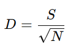
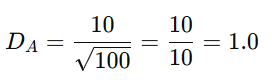
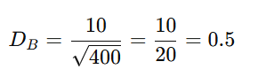

## QM-68-6 Menhinick Index

### Beschreibung

Der Menhinick-Index ist ein Maß zur Quantifizierung der Artenvielfalt, das insbesondere den Artenreichtum unter Berücksichtigung der Stichprobengröße (also der Gesamtzahl der Individuen) bewertet. Sein Hauptziel besteht darin, Bereiche oder Lebensgemeinschaften vergleichbar zu machen, bei denen unterschiedliche Anzahl von Individuen gezählt wurden. 

Der Menhinick-Index ist ein nützliches, relativ einfach zu berechnendes Maß, das die Artenvielfalt anhand der Anzahl der Arten und der Gesamtanzahl der Individuen quantifiziert.
### Formel

Der Menhinick-Index (D) wird wie folgt berechnet:

Dabei ist:
- S die Anzahl der beobachteten Arten (Artenreichtum)
- N die Gesamtzahl der Individuen in der Stichprobe

#### Interpretation der Formel:  
Der Ausdruck $\sqrt{N}$ normalisiert die Anzahl der Arten, indem er den Einfluss der Gesamtzahl der Individuen (Stichprobengröße) berücksichtigt. So wird verhindert, dass Gebiete mit bloß einer hohen Individuenzahl automatisch als artenreicher interpretiert werden. Ein höherer Menhinick-Index deutet demnach auf eine höhere relative Artenvielfalt hin.

- **Vorteile:**
	* Einfache Berechnung: Die Formel ist simpel und leicht anzuwenden
	- Normierung: Die Berücksichtigung der Stichprobengröße ermöglicht vergleichende Analysen zwischen unterschiedlichen Ökosystemen oder Untersuchungsgebieten.
    
- **Limitationen:**
	- Stichprobengröße: Bei sehr kleinen Stichproben kann der Index stark schwanken und eventuell irreführende Aussagen liefern.        
    - Verteilung der Individuen: Der Menhinick-Index berücksichtigt nur den reinen Artenreichtum und nicht die Evenness (d.h. wie gleichmäßig die Individuen auf die Arten verteilt sind). Andere Diversitätsmaße wie der Shannon- oder Simpson-Index liefern zusätzliche Informationen zur Verteilung.

### Beispiele 

#### Beispiel 1 - Vergleich unterschiedlicher Lebensräume:

Durch die Normierung mit der Quadratwurzel der Gesamtzahl der Individuen eignet sich der Menhinick-Index besonders gut, um die Artenvielfalt zwischen Lebensräumen zu vergleichen, bei denen die Anzahl der gesammelten Individuen variiert. Dies ist beispielsweise in ökologischen Studien von Vorteil, in denen Proben aus Gebieten mit unterschiedlicher Probenstärke vorliegen.

- Gebiet A: 10 Arten bei 100 Individuen

- Gebiet B: 10 Arten bei 400 Individuen

Obwohl beide Gebiete die gleiche Artenzahl aufweisen, zeigt Gebiet A einen höheren Menhinick-Index, was darauf hinweist, dass die Artenvielfalt in Relation zur Anzahl der Individuen hier höher ist.

### Sourcecode "Menhinicks Index"

| RefID | Verweis                         |
| ----- | ------------------------------- |
| 91    | QM-68-6_Menhinicks Index_python |

### Referenzen

| RefID | Verweis                                                                                          | Kurzbeschr.                                                                                                                                                                                                                                                                                                                                                                         |
| ----- | ------------------------------------------------------------------------------------------------ | ----------------------------------------------------------------------------------------------------------------------------------------------------------------------------------------------------------------------------------------------------------------------------------------------------------------------------------------------------------------------------------- |
| 283   |  A Comparison of Some Species‐Individuals Diversity Indices Applied to Samples of Field Insects  | Der Text fasst zusammen, dass vier kumulative Arten-/Individuenindizes anhand von Insektendaten eines Lespedeza-Feldes verglichen wurden. Ziel war es, einen intensiven Index zu finden, der unabhängig von der Stichprobengröße ist und Populationen mit gleicher Individuenzahl differenzieren kann. Nur der Index „Arten/Quadratwurzel der Individuen“ erfüllte beide Kriterien. |
